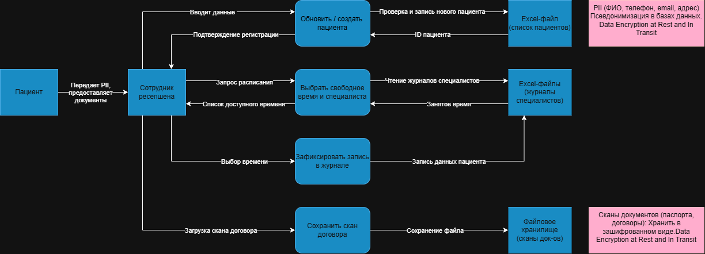
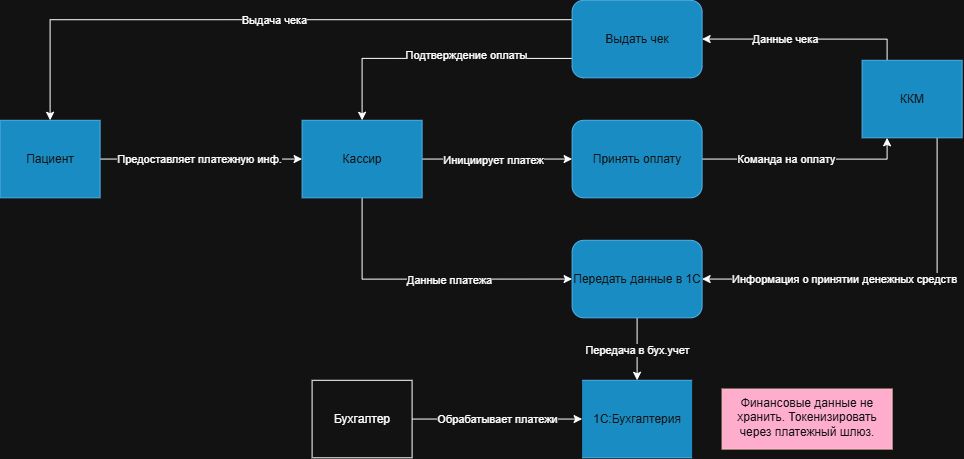
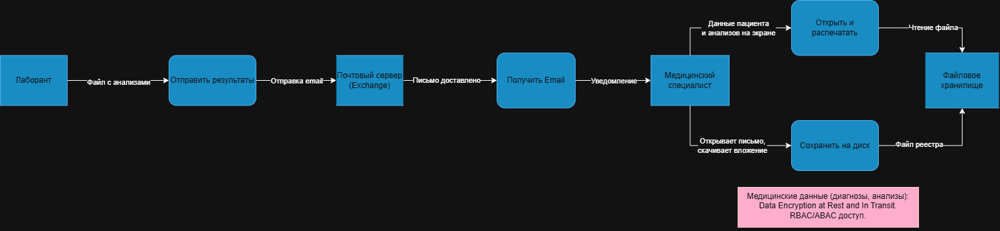

# Задание 1. Анализ безопасности системы

## Диаграммы потоков данных (Data Flow Diagrams)

### Процесс 1: Запись пациента на прием

### Процесс 2: Оплата медицинских услуг

### Процесс 3: Получение результатов анализов из лаборатории

## Список проблемных зон

1. Данные не имеют структурированной модели и не относятся к определённым категориям.
2. Отсутствует полноценный контроль доступа к медицинской информации и данным, относящимся к персональным данным (PII), как на уровне RBAC, так и ABAC.
3. Не ведётся аудит действий пользователей при работе с конфиденциальной информацией.
4. При ручном вводе данных возникают избыточность и дублирование.
5. Данные передаются и хранятся в открытом виде без шифрования.
6. Не соблюдаются требования российского законодательства в области защиты персональных данных (152-ФЗ).
7. Нет безопасных механизмов обмена данными с внешними партнёрами, в частности с лабораторией.

## Рекомендации по улучшению на основе анализа As-Is

Поскольку детальное проектирование новой платформы, выбор конкретных технологий и разработка интеграций будут выполняться в следующих заданиях, на текущем этапе на основании анализа существующих DFD были сформулированы общие требования и направления по повышению безопасности данных.

Для решения выявленных проблем предлагается внедрить следующие механизмы и инструменты, которые должны быть учтены в целевых DFD.

**Список данных и способы их защиты**:

- Прямые персональные данные (ФИО, номер телефона, email, адрес): псевдонимизация с возможностью обратного преобразования для авторизованных сотрудников в базах данных; шифрование при хранении.
- Медицинские данные (диагнозы, результаты анализов): шифрование при хранении; строгий контроль доступа по модели RBAC/ABAC; аудит каждого чтения.
- Финансовые данные (номера карт): не хранить в системе; использовать токенизацию через платёжный шлюз.
- Сканированные документы (паспорта, договоры): хранить в зашифрованном виде с отдельными ключами доступа; индексировать только метаданные, но не персональные данные в имени файла.

**Механизм тегирования данных (Data Tagging)**:
Рекомендуется ввести политику, при которой при создании или загрузке любого документа либо записи в систему она автоматически или вручную помечается тегом, определяющим уровень критичности. Например:

- `PII_Public`: имя, город.
- `PII_Sensitive`: телефон, email, адрес.
- `PII_Medical`: диагнозы, результаты анализов.
- `PII_Financial`: платёжная информация.

Эти теги будут использоваться системами безопасности для применения политик, таких как шифрование, маскирование, запрет на выгрузку и другие меры защиты.

**Список инструментов и мер безопасности**:

- Vault (например, HashiCorp Vault): централизованное хранение секретов, включая ключи шифрования и пароли к базам данных, а также управление доступом к ним.
- API Gateway: для всех новых сервисов (портал клиента, CRM), он будет проверять аутентификацию и авторизацию по тегам данных, а также обеспечивать безопасную передачу информации через mTLS.
- Data Masking/Tokenization Service: сервис, который будет обезличивать данные в реальном времени для неавторизованных пользователей или при передаче в аналитические системы (BI, ML).
- SIEM-система (Security Information and Event Management): решения типа Splunk, ELK Stack или Victoria Metrics для сбора журналов доступа ко всем данным и настройки оповещений о подозрительных действиях.
- Шифрование баз данных: использование прозрачного шифрования данных (TDE) в PostgreSQL и ClickHouse.
- Data Lineage Tools: инструменты для отслеживания происхождения данных, особенно в ML-задачах, чтобы понимать, откуда пришла та или иная информация.