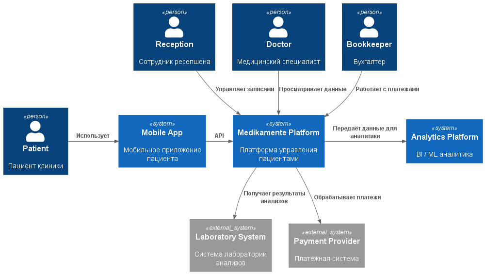

# Задание 2. Проектирование решения

## 1. Дополнительные архитектурные компоненты

Чтобы заложить принципы Privacy by Design в архитектуру, предлагается включить в систему следующие компоненты.

### Identity and Access Management (IAM)

Компонент отвечает за централизованную проверку личности пользователей, предоставление им прав и управление ролями.

Поддерживаемые возможности:
- OAuth2 / OpenID Connect
- RBAC / ABAC
- SSO для сотрудников
- MFA

В качестве реализации можно рассмотреть:
- Keycloak
- Auth0
- Azure AD

### API Gateway

API Gateway предоставляет единый вход для взаимодействия с системой.

Через него можно реализовать:
- авторизация
- rate limiting
- audit
- masking данных
- защита API

### Consent Management Service

Этот сервис предназначен для работы с согласиями пациентов на обработку их персональных данных.

Он обеспечивает:
- хранение согласий
- отзыв согласия
- управление сроками хранения данных
- соответствие требованиям законодательства РФ

### Data Classification Service

Сервис определяет категорию данных в зависимости от степени их конфиденциальности.

Возможные категории:
- Public
- Internal
- Personal Data
- Medical Data (Sensitive)

### Data Tagging System

Система добавляет к данным метки, которые характеризуют их содержание и уровень чувствительности.

Например, могут использоваться следующие теги:
- PII
- MEDICAL
- FINANCIAL
- CONFIDENTIAL

Метки применяются в работе:
- системой доступа
- системой мониторинга
- системой аудита

### Audit/Monitoring System

Система предназначена для наблюдения за обращениями к данным и контроля доступа к ним.

Ключевые функции:
- аудит доступа
- обнаружение аномалий
- уведомления о подозрительной активности

Для построения решения подойдут:
- ELK Stack
- SIEM
- Victoria Metrics

### Secure Data Storage

Компонент обеспечивает защищённое хранение информации.

При его реализации необходимо предусмотреть:
- шифрование
- разделение данных
- контроль доступа

Возможные технологии и средства:
- PostgreSQL
- encrypted storage
- secret management

## 2. Аналитический слой в рамках Privacy by Design

Предполагается, что данные будут применяться для:
- BI
- ML
- AI
- LLM

Для этих задач предлагается создать отдельный аналитический слой (Analytics Layer).

### Data Ingestion Layer

Слой отвечает за загрузку информации из различных источников, включая:
- CRM
- портала
- лаборатории
- платежных систем

### Data Anonymization Layer

До загрузки в аналитическое хранилище информацию следует:
- обезличиваются
- псевдонимизируются
- агрегируются

### Data Lake

Хранилище предназначено для:
- хранения исторических данных
- аналитики
- ML

Для его построения можно использовать:
- ClickHouse
- S3
- Spark

### Analytics / ML Platform

Платформа применяется для подготовки:
- BI
- отчётов
- ML моделей

Технологии:
- Python
- Jupyter
- Spark
- ML pipelines

## 3. Диаграмма контекста

