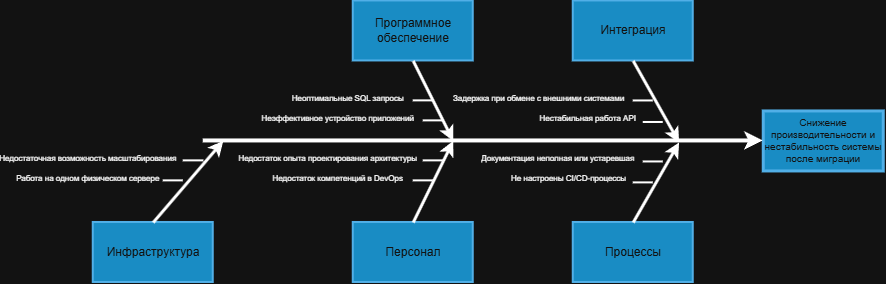

# Задание 4. Анализ ограничений при миграции

## 1. Текущее состояние системы

Архитектура компании Medikamente опирается на ряд устаревающих и слабо связанных решений. Это может осложнить переход на новую платформу и повлиять на её производительность.

### Текущие особенности

- Данные хранятся в таблицах Excel.
- Система 1С работает в файловом режиме.
- Основные компоненты размещены на одном физическом сервере.
- Единого механизма управления данными нет.
- Перемещение данных между системами не контролируется централизованно.
- Действия пользователей не проходят полноценный аудит.

### Направления миграции

В рамках обновления компания намерена:

- перейти к микросервисной архитектуре;
- запустить портал для пациентов;
- связать системы с помощью API;
- создать платформу для аналитики.

## 2. Области, которые затронет миграция

Изменения охватят инфраструктурные и прикладные компоненты, а также связанные с ними процессы.

| Область | Состав |
| --- | --- |
| Инфраструктура | Серверы, сеть и системы хранения данных |
| Данные и СУБД | Файлы Excel, файловые базы 1С и планируемая база PostgreSQL |
| Интеграции | Обмен с лабораторией, платёжными системами и внутренними сервисами |
| Бизнес-функции | Запись пациентов, проведение платежей и ведение медицинских карт |

## 3. Диаграмма Исикавы

Диаграмма помогает определить факторы, которые могут привести к узким местам и снижению производительности после перехода на новую архитектуру. Анализ сгруппирован по пяти направлениям: инфраструктура, программное обеспечение, интеграции, персонал и процессы.

## 4. Выявленные риски

| Категория | Ограничение или проблема | Возможное влияние |
| --- | --- | --- |
| Инфраструктура | Работа на одном физическом сервере | При отказе оборудования система может стать недоступна |
| Инфраструктура | Недостаточная возможность масштабирования | Рост нагрузки может привести к снижению производительности |
| Программное обеспечение | Неэффективное устройство приложений | Увеличение времени отклика сервисов |
| Программное обеспечение | Неоптимальные SQL-запросы | Повышенная нагрузка на базу данных |
| Интеграции | Нестабильная работа API | Ошибки и несогласованность данных |
| Интеграции | Задержки при обмене с внешними системами | Ухудшение пользовательского опыта |
| Персонал | Недостаток компетенций в DevOps | Ошибки при развертывании и сопровождении |
| Персонал | Недостаток опыта проектирования архитектуры | Риск неудачных архитектурных решений |
| Процессы | Не настроены CI/CD-процессы | Увеличение времени выпуска изменений |
| Процессы | Документация неполная или устаревшая | Сложности при поддержке системы |

## 5. Меры по снижению рисков

### Инфраструктура

- Разместить систему в облачной среде.
- Рассмотреть Kubernetes для управления контейнеризированными сервисами.
- Настроить автоматическое масштабирование ресурсов.

### Данные и базы данных

- Перенести данные из Excel в PostgreSQL.
- Настроить репликацию для повышения доступности данных.
- Анализировать и оптимизировать SQL-запросы.

### Интеграции

- Использовать API Gateway для управления входящими и исходящими запросами.
- Применять брокер сообщений для асинхронного обмена между системами, например Kafka или RabbitMQ.

### Разработка и эксплуатация

- Внедрить CI/CD для автоматизации сборки, проверок и выпуска изменений.
- Описывать инфраструктуру как код.
- Рассмотреть GitLab CI, Terraform и Helm в качестве инструментов.

### Мониторинг

- Отслеживать состояние компонентов системы и доступность сервисов.
- Собирать показатели производительности и настраивать оповещения.
- Для мониторинга и визуализации можно использовать Prometheus, VictoriaMetrics и Grafana.

## 6. Очерёдность внедрения мер

| Приоритет | Мера | Обоснование |
| --- | --- | --- |
| Высокий | Перевод данных в централизованную базу | Сокращает зависимость от разрозненных Excel-файлов |
| Высокий | Внедрение CI/CD | Ускоряет и упорядочивает выпуск изменений |
| Высокий | Настройка мониторинга | Помогает раньше обнаруживать сбои и деградацию производительности |
| Средний | Внедрение API Gateway | Обеспечивает единый контроль интеграций |
| Средний | Использование Kubernetes | Создаёт основу для масштабирования сервисов |
| Низкий | Оптимизация бизнес-процессов | Поддерживает дальнейшее долгосрочное развитие системы |