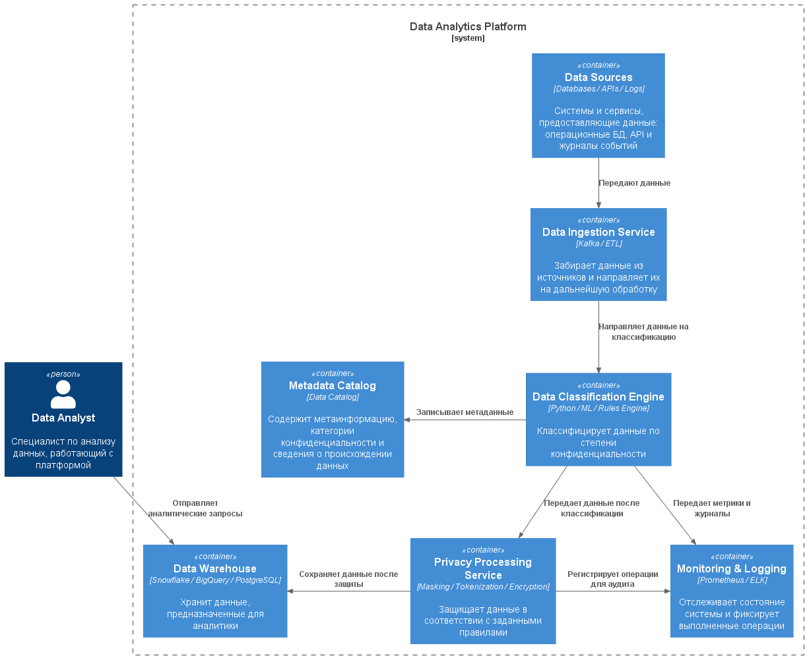

# Задание 6. Классификация данных

## 1. Архитектура системы классификации

В соответствии с принципом **Privacy by Design** перед передачей информации в аналитическое хранилище следует выполнять её классификацию. Для этого в архитектуру включён отдельный слой — **Data Classification Layer**.

Слой проверяет поступающие данные, назначает им класс конфиденциальности и выбирает подходящие меры обработки. Поскольку структура данных может меняться, а сами данные не всегда имеют разметку, решение сочетает правила, методы машинного обучения и анализ метаданных.

### C4-диаграмма движка классификации

На диаграмме показан движок, который классифицирует данные до их загрузки в хранилище.

## 2. Логическая архитектура решения

Решение состоит из нескольких взаимодействующих компонентов.

### Data Ingestion Layer — слой приёма данных

Компонент получает информацию из различных источников, выполняет начальную проверку и направляет её на классификацию.

**Источники данных:**

- операционные базы данных;
- API;
- файлы журналов;
- внешние сервисы.

**Возможные инструменты:**

- Kafka или RabbitMQ;
- ETL/ELT-конвейеры, например Airflow.

**Основные задачи:**

- сбор данных;
- первичная валидация;
- передача данных в движок классификации.

### Data Classification Engine — движок классификации

Центральный компонент решения. Он исследует структуру и содержимое данных, обнаруживает персональную информацию, определяет уровень конфиденциальности и дополняет данные метаданными.

Классификация опирается на несколько методов:

1. **Правила и регулярные выражения.** Помогают находить, например, адреса электронной почты, номера телефонов, паспортов и банковских карт.
2. **Машинное обучение.** Применяется для определения типов полей и классификации текстовой информации.
3. **Анализ метаданных.** Учитывает названия полей, типы данных и источники их получения.

### Privacy Processing Layer — слой защиты данных

После присвоения класса к данным применяются соответствующие политики защиты. В зависимости от типа информации могут использоваться:

- маскирование (Masking);
- токенизация (Tokenization);
- шифрование (Encryption);
- анонимизация (Anonymization);
- псевдонимизация (Pseudonymization).

| Тип данных | Пример обработки |
| --- | --- |
| Адрес электронной почты | Маскирование |
| Номер банковской карты | Токенизация |
| Журналы событий | Анонимизация |

### Metadata Catalog — каталог метаданных

Каталог содержит сведения о классах данных, их источниках, правилах обработки и происхождении данных (data lineage).

В качестве инструментов можно использовать Nessie, DataHub или Glue.

### Data Warehouse — аналитическое хранилище

В хранилище данные распределяются по уровням в зависимости от степени их обработки и требований к доступу:

- **Raw Layer** — исходные данные без обработки;
- **Classified Layer** — данные, прошедшие классификацию;
- **Trusted Layer** — очищенные и подготовленные данные;
- **Secure Layer** — данные, доступ к которым ограничен.

## 3. Классы данных

| Класс | Примеры | Уровень риска | Подход к обработке |
| --- | --- | --- | --- |
| Public | Открытая информация | Низкий | Без специальных ограничений |
| Internal | Служебная информация | Средний | Контроль доступа |
| Confidential | Финансовая информация | Высокий | Шифрование |
| Sensitive | Персональные данные | Критический | Маскирование и токенизация |

## 4. Метрики качества и производительности

Эффективность классификатора оценивается с помощью следующих показателей:

- **Accuracy** — доля данных, которым назначен правильный класс;
- **Precision** — точность обнаружения конфиденциальной информации;
- **Recall** — способность находить все конфиденциальные данные;
- **False Positive Rate** — доля обычных данных, ошибочно отмеченных как конфиденциальные;
- **Latency** — время, необходимое для обработки и классификации данных;
- **Coverage** — доля данных, прошедших классификацию.

## 5. Масштабирование

Для обработки растущей нагрузки архитектура поддерживает несколько подходов к масштабированию.

### Горизонтальное масштабирование

Пропускную способность можно увеличивать за счёт разделов Kafka и автоматического масштабирования ресурсов Kubernetes.

### Независимое масштабирование компонентов

Микросервисная структура позволяет отдельно масштабировать приём данных, классификацию и их последующую обработку.

### Обработка потоков

Для работы с большими непрерывными потоками данных могут применяться Apache Flink или Spark Streaming.

### Кэширование правил

Правила классификации можно хранить в Redis, чтобы ускорить доступ к ним во время обработки.

## 6. Возможности расширения

Систему можно развивать по нескольким направлениям:

- подключать новые ML-модели, включая NLP-модели для анализа текста;
- добавлять классы данных, например биометрические данные и геолокацию;
- интегрировать дополнительные источники: IoT-устройства, мобильные приложения и внешние API.
